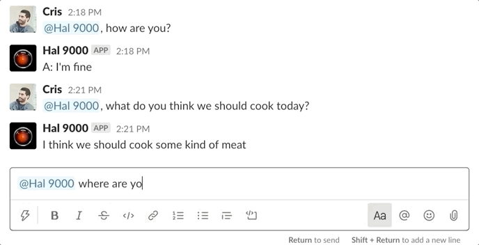

# A GPT-2 Slack Bot using RunwayML's hosted models

### Check out the tutorial to get started: LINK_TO_MEDIUM

## Glitch Version

Remix this code in [Glitch]()

## Resources

- [Download Runway](https://runwayml.com/download)
- [Hosted Models Docs](https://learn.runwayml.com/#/how-to/hosted-models)
- [Hosted Models JS SDK](https://github.com/runwayml/hosted-models)

## License

MIT